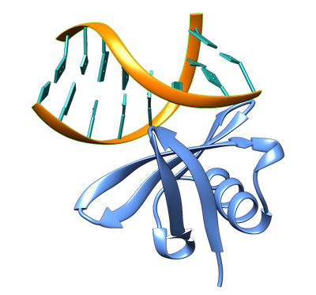

<hr>

# LightDock 1AZP Protein-DNA example

This is a complete example of the LightDock protocol when residue restraints are specified using the [1AZP](https://www.rcsb.org/structure/1azp) protein-DNA complex as an example.



All the files used in this example can be found in the path [examples/1AZP](https://github.com/brianjimenez/lightdock/tree/master/examples/1AZP).

**IMPORTANT: We recommend you to create a new folder and to copy the starting files `1AZP_A.pdb`, `1AZP_B.pdb` and `restraints.list` to that folder in case you would like to run this example.**

## 1. Setup

### 1.1. Removing and adding hydrogen atoms

First of all, we need the protein partner to have the correct hydrogen atoms in order for the `dna` scoring function to work properly (`dna` scoring function is based in AMBER force-field). To do it so, we will use the software `reduce` which can be downloaded from [GitHub](https://github.com/rlabduke/reduce).

We remove the previous hydrogens and them rebuild them according to reduce:

```
reduce -Trim 1AZP_A.pdb > 1AZP_A_noh.pdb
reduce -BUILD 1AZP_A_noh.pdb > 1AZP_A_h.pdb
```

### 1.2. LightDock setup

First, run the setup:

```
lightdock_setup 1AZP_A_h.pdb 1AZP_B.pdb 400 200 -anm -rst restraints.list
```

The output should be something like this:

``` 
@> ProDy is configured: verbosity='info'
[lightdock_setup] INFO: Reading structure from 1AZP_A_h.pdb PDB file...
[lightdock_setup] INFO: 1094 atoms, 66 residues read.
[lightdock_setup] INFO: Reading structure from 1AZP_B.pdb PDB file...
[pdb] WARNING: Possible problem: [ResidueNonStandardError] Can not check non-standard residue DG.1
[pdb] WARNING: Possible problem: [ResidueNonStandardError] Can not check non-standard residue DC.2
[pdb] WARNING: Possible problem: [ResidueNonStandardError] Can not check non-standard residue DG.3
[pdb] WARNING: Possible problem: [ResidueNonStandardError] Can not check non-standard residue DA.4
[pdb] WARNING: Possible problem: [ResidueNonStandardError] Can not check non-standard residue DT.5
[pdb] WARNING: Possible problem: [ResidueNonStandardError] Can not check non-standard residue DC.6
[pdb] WARNING: Possible problem: [ResidueNonStandardError] Can not check non-standard residue DG.7
[pdb] WARNING: Possible problem: [ResidueNonStandardError] Can not check non-standard residue DC.8
[pdb] WARNING: Possible problem: [ResidueNonStandardError] Can not check non-standard residue DG.9
[pdb] WARNING: Possible problem: [ResidueNonStandardError] Can not check non-standard residue DC.10
[pdb] WARNING: Possible problem: [ResidueNonStandardError] Can not check non-standard residue DG.11
[pdb] WARNING: Possible problem: [ResidueNonStandardError] Can not check non-standard residue DA.12
[pdb] WARNING: Possible problem: [ResidueNonStandardError] Can not check non-standard residue DT.13
[pdb] WARNING: Possible problem: [ResidueNonStandardError] Can not check non-standard residue DC.14
[pdb] WARNING: Possible problem: [ResidueNonStandardError] Can not check non-standard residue DG.15
[pdb] WARNING: Possible problem: [ResidueNonStandardError] Can not check non-standard residue DC.16
[lightdock_setup] INFO: 328 atoms, 16 residues read.
[lightdock_setup] INFO: Calculating reference points for receptor 1AZP_A_h.pdb...
[lightdock_setup] INFO: Done.
[lightdock_setup] INFO: Calculating reference points for ligand 1AZP_B.pdb...
[lightdock_setup] INFO: Done.
[lightdock_setup] INFO: Saving processed structure to PDB file...
[lightdock_setup] INFO: Done.
[lightdock_setup] INFO: Saving processed structure to PDB file...
[lightdock_setup] INFO: Done.
[lightdock_setup] INFO: Calculating ANM for receptor molecule...
[lightdock_setup] INFO: 10 normal modes calculated
[lightdock_setup] INFO: Calculating ANM for ligand molecule...
[lightdock_setup] INFO: 10 normal modes calculated
[lightdock_setup] INFO: Reading restraints from restraints.list
[lightdock_setup] INFO: Number of receptor restraints is: 3 (active), 0 (passive)
[lightdock_setup] INFO: Number of ligand restraints is: 0 (active), 0 (passive)
[lightdock_setup] INFO: Calculating starting positions...
[lightdock_setup] INFO: Generated 27 positions files
[lightdock_setup] INFO: Done.
[lightdock_setup] INFO: Number of swarms is 27 after applying restraints
[lightdock_setup] INFO: Preparing environment
[lightdock_setup] INFO: Done.
[lightdock_setup] INFO: LightDock setup OK
```

At the moment, LightDock is not checking the structure of the nucleotides, so that is the reason of the several warning appearing. It is safe to ignore them.


## 2. Simulation

We can run our simulation in a local machine or in a HPC cluster. For the first option, simply run the following command:

```
lightdock setup.json 100 -s dna -c 8
```

Where the flag `-c 8` indicates LightDock to use 8 available cores. For this example we will run `100` steps of the protocol and the DNA scoring function `-s dna`.


To run a LightDock job on a HPC cluster, a Portable Batch System (PBS) file can be generated. This PBS file defines the commands and cluster resources used for the job. A PBS file is a plain-text file that can be easily edited with any UNIX editor. For example, create a `submit_job.sh` file containing:

```
#PBS -N LightDock-1AZP
#PBS -q medium
#PBS -l nodes=1:ppn=16
#PBS -S /bin/bash
#PBS -d ./
#PBS -e ./lightdock.err
#PBS -o ./lightdock.out

lightdock setup.json 100 -s dna -c 16
```

This script tells the PBS queue manager to use 16 cores of a single node in a queue with name `medium`, with job name `LigthDock-1AZP` and with standard output to `lightdock.out` and error output redirected to `lightdock.err`.

To run this script you can do it so:

```
qsub < submit_job.sh
```

