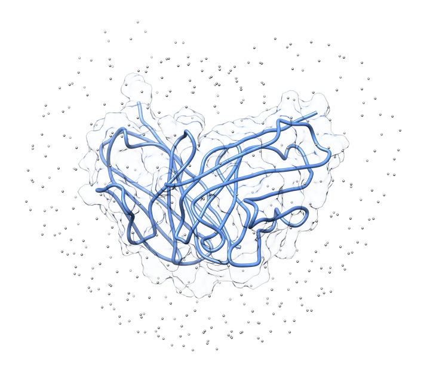
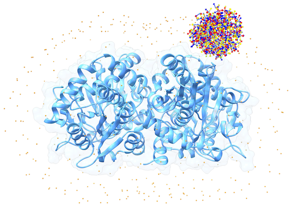
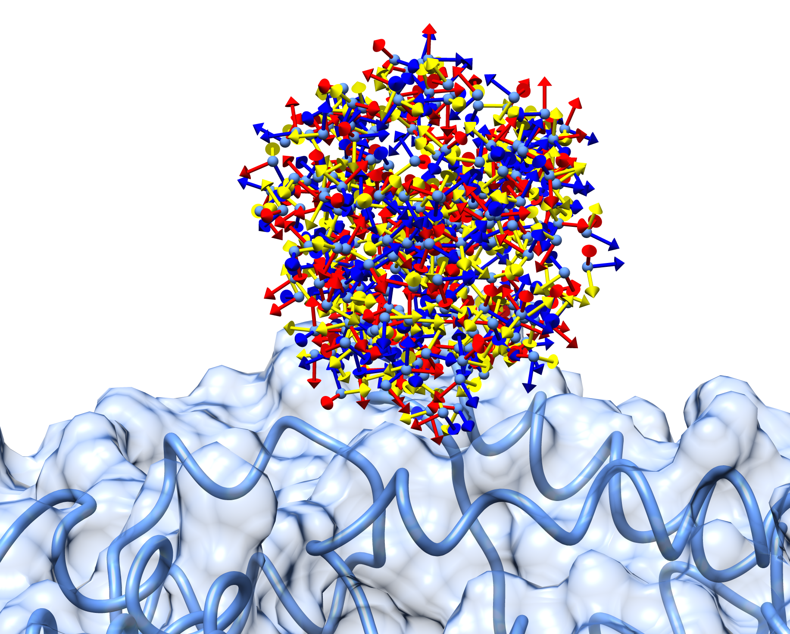

<hr>

# Official Documentation

#### Table of Contents

- [Introduction](#1-introduction)
- [Setup a simulation](#2-setup-a-simulation)
- [Run a simulation](#3-run-a-simulation)
- [Generate models](#4-generate-models)
- [Clustering](#5-clustering)
- [Custom Scoring Functions](#6-custom-scoring-functions)
- [Examples](#7-examples)


## 1. Introduction

### 1.1. What is LightDock?
LightDock is a protein-protein and protein-DNA docking protocol based on the [Glowworm Swarm Optimization](https://link.springer.com/article/10.1007/s11721-008-0021-5) (GSO) algorithm. The first version of the LightDock protocol was published in [Oxford Bioinformatics](https://academic.oup.com/bioinformatics) journal:

**LightDock: a new multi-scale approach to protein–protein docking**<br>
[Brian Jiménez-García](http://bjimenezgarcia.com), Jorge Roel-Touris, Miguel Romero-Durana, Miquel Vidal, Daniel Jiménez-González and Juan Fernández-Recio<br>
*Bioinformatics*, Volume 34, Issue 1, 1 January 2018, Pages 49–55, [https://doi.org/10.1093/bioinformatics/btx555](https://doi.org/10.1093/bioinformatics/btx555)

Specific details of the protocol can be found in the publication mentioned above, but in summary, LightDock is:

- *Ab initio* protocol, which means that only requires of the 3D coordinates of the protein partners for predicting the protein-protein, protein-peptide or protein-DNA complex.

- Capable of modeling protein-protein, protein-peptide and protein-DNA complexes in rigid-body fashion or modeling backbone flexibility using [Anisotropic Network Model](https://en.wikipedia.org/wiki/Anisotropic_Network_Model) (ANM). If ANM mode is activated, LightDock calculates the Ca-Ca ANM model using the awesome [ProDy](http://prody.csb.pitt.edu/) Python library. By default, the first 10 non-trivial normal modes are calculated for both receptor and ligand (in every residue backbone, extended to side-chains). See [Prody ANM documentation](http://prody.csb.pitt.edu/tutorials/enm_analysis/anm.html) for an example. The number of non-trivial normal modes can be tuned by the user. 

- Customizable by the user. LightDock is not only a protocol, but a framework for testing and developing custom scoring functions. The GSO optimization algorithm is agnostic of the force-field used, so in theory LightDock is capable of minimizing the docking energies in any force-field given by the user. See [Custom Scoring Functions](#6-custom-scoring-functions) section for more details.

- Prepared to scale in [HPC](https://en.wikipedia.org/wiki/Supercomputer) architectures. LightDock nature is *embarrassingly parallel* as each swarm is treated as an independent simulation. This property makes LightDock to scale up to a number of CPU cores equal to the number of swarms simulated. Two implementations are given: 1) [multiprocessing](https://docs.python.org/2/library/multiprocessing.html) (by default) and 2) MPI (using [mpi4py](http://mpi4py.scipy.org/docs/) library).

- Capable of using multiple scoring functions during the minimization. Instead of specifiying a single scoring function, a file containing the weight and the name of the scoring function can be given as an input. LightDock will combine the different scoring functions as a linear combination of their value multiplied by the weight specified in the file.


### 1.2. Swarms
In LightDock, the receptor molecule is kept fixed (despite atoms positions can move if ANM mode is enabled). Over its surface, a set of points is calculated. Each of these points is a swarm center which represents an independent simulation. For example, for complex [1VFB](https://www.rcsb.org/structure/1VFB), 400 swarms are calculated:



For each of these swarm centers, a number *N* of glowworms, the algorithm agents, are disposed in a random way (if residue restraints are not being applied). Every glowworm represents a possible ligand conformation. In the following figure a set of 300 glowworms is displayed in a single swarm:



More in detail, each glowworm is represented as a 3D-axis object in its center of mass and oriented as the actual 3D-axis orientation:




## 2. Setup a simulation

In LightDock versions prior to 0.5.0, this step was optional. From version 0.5.0, a setup step is mandatory for any simulation. This new setup step reduces complexity of the main program and it allows the use of residue restraints.

If you execute `lightdock_setup` several options will appear:

```bash
usage: lightdock_setup [-h] [--seed_points STARTING_POINTS_SEED]
                       [-ft ftdock_file] [--noxt] [-anm] [--seed_anm ANM_SEED]
                       [-anm_rec ANM_REC] [-anm_lig ANM_LIG] [-rst restraints]
                       [-membrane]
                       receptor_pdb_file ligand_pdb_file swarms glowworms
lightdock_setup: error: too few arguments

```

The mandatory arguments (not enclosed by `[` and `]`)  are:

- **receptor\_pdb\_file**: the PDB file containing the receptor structure
- **ligand\_pdb\_file**: the PDB file containing the ligand structure
- **swarms**: the number of swarms of the simulations
- **glowworms**: the number or glowworms for each swarm

In the original publication, for each complex of the [Protein-Protein Benchmark v5](https://zlab.umassmed.edu/benchmark/) analyzed, the number of swarms and glowworms were:

```
Number of swarms: 400
Number of glowworms per swarm: 300
```

We found reasonable those values for number of swarms and glowworms per swarm in order to ensure a certain density and exhaustiveness of sampling, despite for smaller molecules, a smaller number of swarms could be completely valid.

Below, there is a description of the rest of accepted paramenters by `lightdock_setup`:

- **--seed_points** *STARTING_POINTS_SEED*: An integer can be specified as the seed used in the random number generator of the initial random poses of the ligand.
- **--ft** *ftdock_file*: LightDock can read the output of the venerable [FTDock](http://www.sbg.bio.ic.ac.uk/docking/ftdock.html) software in order to use the FTDock rigid-body predictions as the starting poses of the LightDock simulation. In order to do so, `lightdock_setup` classifies the different FTDock predictions according to its translation into the corresponding swarm over the surface of the receptor. **This option is deprecated**.
- **--noxt**: If this option is enabled, LightDock ignores OXT atoms. This is useful for several scoring functions which don't understand this special type of atom.
- **--anm**: If this option is enabled, the ANM mode is activated and backbone flexibility is modeled using ANM (via ProDy).
- **--seed_anm** *ANM_SEED*: An integer can be specified as the seed used in the random number generator of ANM normal modes extents. 
- **--anm_rec** *ANM_REC*: The number of non-trivial normal modes calculated for the recepetor in the ANM mode.
- **--anm_lig** *ANM_LIG*: The number of non-trivial normal modes calculated for the ligand in the ANM mode.
- **-rst** *restraints_file*: If `restraints_file` is provided, residue restraints will be considered during the setup and the simulation. See `2.2. Residue Restraints` section for more information.
- **-membrane**: When enabled, this experimental flag considers the receptor molecule aligned to the Z-axis and filters out swarms which would not be compatible with a trans-membrane domain. To do so, it makes use of the residues provided as receptor restraints. Therefore, this flag will be only valid when **-rst** is enabled.


### 2.1. Results of the setup

After the execution of `lightdock_setup` script, several files and directories will be generated in the root of your docking project:

- `init`: A directory containing initialization data, see below:
    - `cluster_centers.pdb`: A file in PDB format containing dummy atoms which coordinates correspond to a swarm center.
    - `initial_positions_X.dat`: One file like this for each swarm (where `X` indicates the id of the swarm), containing the translation, quaternion and normal modes extents (if ANM is activated) for each of the glowworms in this swarm.
    - `starting_positions_X.pdb`: Same as before, but a PDB file with the glowworm translation vector expressed as a dummy atom.
    - `starting_poses_X.bild`: Same as before, but this time every glowworm pose in rotational space is expressed as a BILD 3D object which can be readed by UCSF Chimera. More information about the format can be found [here](https://www.cgl.ucsf.edu/chimera/docs/UsersGuide/bild.html).
- `swarm_0, ..., swarm_(N-1)`: For each of the `N` swarms specified by the `swarms` argument, a directory is created. Note that the first directory is called `swarm_0` and not `swarm_1`.
- `setup.json`: A file with a summary of the setup step in JSON format. This file will be necessary for running the simulation in the next step.
- `lightdock_*.pdb`: LightDock parses the input PDB structures and creates two new PDB files, one for the receptor and one for the ligand where the molecules have been centered to the origin of coordinates.
- `*.xyz.npy`: Two files with this extension, one for the receptor and one for the ligand, which contains information about the minimum ellipsoid containing each of the structures in NumPy format.
- `lightdock_rec.nm.npy`and `lightdock_lig.nm.npy`: If ANM is enabled, two files are created containing the normal modes information calculated by the ProDy library.

### 2.2. Residue Restraints

From version `0.6.0`, distance restraints on both receptor and ligand have been implemented. This new feature works in the following way:

From a `restraints_file` file containing the following information:

```
R A.SER.150 
R A.TYR.151 P
L B.LYS.2
L B.ARG.3 P
```

Where `R` means for `Receptor` and `L` means for `Ligand`, and then the rest of the line is a residue identifier in the format `Chain.Residue_Name.Residue_Number` in the original PDB file numeration. A `P` label in the end indicates this restraint is **passive** in contrast to **active**.

For each residue restraint specified for the receptor, only the closest swarms are considered during `lightdock_setup`. At the moment, only the **10 closest swarms** for each residue are considered. If some of the swarms overlap, then only one copy of that swarm is used. If no residue restraints at ligand level are specified, random orientations for the ligand molecule will be generated. On the other hand, if residue restraints on the ligand level have been defined, `lightdock_setup` will find random `{receptor residue restraint, ligand residue restraint}` pairs (only considering the closest receptor residue restraints to the given swarm) and it will orient the given `ligand residue restraint` towards `receptor residue restraint`. With this mechanism, the algorithm is biased towards correct orientations of the ligand molecule.

Then, the simulation will try to optimize both energy and restraints satisfied taking into account only **active** residues.

The following scoring functions are prepared to be used with residue restraints:

* [DFIRE](../lightdock/scoring/dfire)
* [FastDFIRE](../lightdock/scoring/fastdfire)
* [CPyDock](../lightdock/scoring/cpydock)

Once the simulation has ended, the script `lgd_filter_restraints.py` should be used in order to remove predictions which do not satisfy the provided restraints.

**See a complete example of the LightDock protocol (setup with restraints, simulation, clustering and filtering) [here](4G6M.md).**

### 2.3. Tips and tricks

- As a general rule of thumb, the receptor structure is the bigger molecule and the ligand the smaller. For this concept of size, the metric used is the longest diameter of the minimum ellipsoid containing the molecule. A script called `lgd_calculate_diameter.py` can be found in `$LIGHTDOCK_HOME/bin/support` path in order to calculate an approximation of that metric.

- If the `init` directory exists, `lightdock_setup` makes use of the information contained in that directory.

- The file `setup.json` is intended for reproducibility of the results, but not to be modified by the user.

- Passive residue restraints are used only to filter or bias the orientations, but not considered in the scoring function.


## 3. Run a simulation

### 3.1. Parameters

In order to run a LightDock simulation, the `lightdock` script has to be executed. If the script is executed without arguments, a list of accepted options is displayed:

```bash
usage: lightdock [-h] [-f configuration_file] [-s SCORING_FUNCTION]
                 [-sg GSO_SEED] [-t TRANSLATION_STEP] [-r ROTATION_STEP] [-V]
                 [-c CORES] [--profile] [-mpi] [-ns NMODES_STEP] [-min]
                 [--listscoring]
                 setup_file steps
lightdock: error: too few arguments
```

The simplest way to execute a LightDock simulation is:

```bash
lightdock setup.json 10
```

The first parameter is the configuration file generated on the setup step, the second is the number of steps of the simulation.

The rest of possible arguments which `lightdock` accepts is:

- **-f** *configuration_file*: This is a special file containing the different parameters of the GSO algorithm. By default, this is not necessary to change, but advanced users might change some of the values. Here it is an example of the content of this file:

```
##
#
# GlowWorm configuration file - algorithm parameters
#
##

[GSO]

# Rho
rho = 0.4

# Gamma
gamma = 0.6

# Initial Luciferin
initialLuciferin = 5.0

# Initial glowworm vision range (in A)
initialVisionRange = 15.0

# Max vision range (in A)
maximumVisionRange = 40.0

# Beta
beta = 0.16

# Max number of neighbors
maximumNeighbors = 5
```

These are the parameters used in the LightDock publication, many of them inherited from the original GSO publication. Please refer to the [Kaipa, Krishnanand N. and  Ghose, Debasish](https://www.springer.com/gp/book/9783319515946) for more details.

- **-s** *SCORING_FUNCTION*: Probably one of the most important parameters of the simulation. The user is able to change the default scoring function (DFIRE, fast C implementation `fastdfire`) using this flag. A name of a scoring function or a file containing the name and weight of multiple scoring functions are accepted. See section 3.2 for a complete list of accepted scoring functions and how to combine them.
- **-c** *CORES*: By default, LightDock makes use of the total number of available CPU cores on the hardware to run the simulation, but a different number of CPU cores can be specified via this option.
- **-mpi**: If this flag is activated, LightDock will make use of the MPI4py library in order to spread to diffeerent nodes.
- **--profile**: This is a experimental flag and it is intended for profiling computation time and memory used by LightDock.
- **-sg** *GSO_SEED*: It is the integer used as a seed for the random number generator in charge of running the simulation. Different seeds will incur in different simulation outputs.
- **-t** *TRANSLATION_STEP*: When the translation part of the optimization vector is interpolated, this parameter controls the interpolation point. By default is set to 0.5. 
- **-r** *ROTATION_STEP*: When the rotation part of the optimization vector is interpolated (using [quaternion SLERP](https://en.wikipedia.org/wiki/Slerp#Quaternion_Slerp)), this parameter controls the interpolation point. By default is set to 0.5.
- **-ns** *NMODES_STEP*: When the ANM normal modes extent part of the optimization vector is interpolated, this parameter controls the interpolation point. By default is set to 0.5.
- **-min**: If this option is enabled, a local minimization of the best glowworm in terms of scoring is performed for each step, at each swarm. The algorithm used is the Powell ([fmin_powell](https://docs.scipy.org/doc/scipy-0.18.1/reference/generated/scipy.optimize.fmin_powell.html)) implementation from the scipy.optimize library.
- **--listscoring**: shows the scoring functions available.
- **-V**: displays the LightDock version.


### 3.2. Available scoring functions

The complete list of scoring functions implemented in LightDock is:

- `cpydock`: Implementation in C of the [pyDock](https://www.ncbi.nlm.nih.gov/pubmed/17444519) scoring function (also known as pyDockLite).
- `dfire`: Implementation of the [DFIRE](https://www.ncbi.nlm.nih.gov/pubmed/15162489) scoring function in Cython.
- `fastdfire`: Implementation of the DFIRE scoring function using the Python C-API, faster than `dfire`.
- `dfire2`: Implementation of the [DFIRE2](https://www.ncbi.nlm.nih.gov/pubmed/18469178) scoring function using the Python C-API, despite a Cython version is also included for demonstrational purposes.
- `dna`: Implementation of the pyDockDNA scoring function (no desolvation) and custom Van der Waals weight for protein-DNA docking. Implemented using the Python C-API.
- `mj3h`: Pairwise contact energies for 20 types of residues, [Mj3h](https://www.ncbi.nlm.nih.gov/pubmed/10336383).
- `pisa`: A statistical potential from the [Improving ranking of models for protein complexes with side chain modeling and atomic potentials](https://onlinelibrary.wiley.com/doi/abs/10.1002/prot.24214) publication.
- `sd`: An electrostatics and Van der Waals based scoring function as described in the [SwarmDock publication](https://www.ncbi.nlm.nih.gov/pubmed/21152290), but using AMBER94 force-field charges and parameters.
- `sipper`: Intermolecular pairwise propensities of exposed residues, [SIPPER](https://www.ncbi.nlm.nih.gov/pubmed/21214199).
- `tobi`: [TOBI](https://bmcstructbiol.biomedcentral.com/articles/10.1186/1472-6807-10-40) potentials scoring function.
- `vdw`: A truncated Van der Waals (Lennard-Jones potential) as described in the original [pyDock](https://www.ncbi.nlm.nih.gov/pubmed/17444519) publication.

### 3.2.1. Multiple scoring functions

Several scoring functions can be used simultaneously by LightDock during the minimization. Each glowworm in the simulation will count on a model for each different scoring function, thus physical memory could be a limit on the number of simultaneous scoring functions.

A file containing the name of the scoring function and its weight can be defined as this example:

```bash
cat socring.conf
sipper 0.5
dfire 0.8
```

For each pose, the scoring would be in this example the linear combination of both functions:

```Scoring = 0.5*SIPPER + 0.8*DFIRE```
  

### 3.3. Tips and tricks

- All the available scoring fundtions can be found at the path `$LIGHTDOCK_HOME/lightdock/scoring`. Each scoring function has its own directory.


## 4. Generate models

Once the simulation has completed, the predicted models can be generated as PDB structure files. In order to do so, execute the `lgd_generate_conformations.py` command:

```bash
lgd_generate_conformations.py 
usage: conformer_conformations [-h]
                               receptor_structure ligand_structure
                               lightdock_output glowworms
conformer_conformations: error: too few arguments
```

For example, to generate the 10 models predicted in the step 5 in a swarm populated by 10 glowworms of the 2UUY example:

```bash
cd $LIGHTDOCK_HOME/examples/2UUY
cd swarm_0
lgd_generate_conformations.py ../2UUY_rec.pdb ../2UUY_lig.pdb gso_5.out 10
```

**IMPORTANT:** note that the structures used by this command are the originals used in the `lightdock_setup` command.

## 5. Clustering

There are two different methods for clustering the predicted models implemented: *BSAS* and *hierarchical*. At the moment, *hierarchical* is deprecated and the *BSAS* method is the preferred one.

For each swarm, you can execute the `lgd_cluster_bsas.py` command. For example:

```bash
cd swarm_0
lgd_cluster_bsas.py gso_5.out
```

The output would be:

```
Reading CA from lightdock_3.pdb
Reading CA from lightdock_6.pdb
Reading CA from lightdock_0.pdb
Reading CA from lightdock_5.pdb
Reading CA from lightdock_9.pdb
Reading CA from lightdock_7.pdb
Reading CA from lightdock_2.pdb
Reading CA from lightdock_8.pdb
Reading CA from lightdock_1.pdb
Reading CA from lightdock_4.pdb
Glowworm 6 with pdb lightdock_6.pdb
RMSD between 3 and 6 is 7.562
New cluster 1
Glowworm 0 with pdb lightdock_0.pdb
RMSD between 3 and 0 is 7.757
RMSD between 6 and 0 is 9.089
New cluster 2
Glowworm 5 with pdb lightdock_5.pdb
RMSD between 3 and 5 is 6.856
RMSD between 6 and 5 is 8.706
RMSD between 0 and 5 is 4.665
New cluster 3
Glowworm 9 with pdb lightdock_9.pdb
RMSD between 3 and 9 is 3.683
Glowworm 9 goes into cluster 0
Glowworm 7 with pdb lightdock_7.pdb
RMSD between 3 and 7 is 6.830
RMSD between 6 and 7 is 7.673
RMSD between 0 and 7 is 6.709
RMSD between 5 and 7 is 4.561
New cluster 4
Glowworm 2 with pdb lightdock_2.pdb
RMSD between 3 and 2 is 7.346
RMSD between 6 and 2 is 9.084
RMSD between 0 and 2 is 7.646
RMSD between 5 and 2 is 7.772
RMSD between 7 and 2 is 9.414
New cluster 5
Glowworm 8 with pdb lightdock_8.pdb
RMSD between 3 and 8 is 7.980
RMSD between 6 and 8 is 5.623
RMSD between 0 and 8 is 8.147
RMSD between 5 and 8 is 8.182
RMSD between 7 and 8 is 7.451
RMSD between 2 and 8 is 8.337
New cluster 6
Glowworm 1 with pdb lightdock_1.pdb
RMSD between 3 and 1 is 5.530
RMSD between 6 and 1 is 9.025
RMSD between 0 and 1 is 6.481
RMSD between 5 and 1 is 6.954
RMSD between 7 and 1 is 7.928
RMSD between 2 and 1 is 3.114
Glowworm 1 goes into cluster 5
Glowworm 4 with pdb lightdock_4.pdb
RMSD between 3 and 4 is 9.306
RMSD between 6 and 4 is 7.367
RMSD between 0 and 4 is 8.225
RMSD between 5 and 4 is 9.455
RMSD between 7 and 4 is 8.641
RMSD between 2 and 4 is 9.509
RMSD between 8 and 4 is 7.742
New cluster 7
{0: [3, 9], 1: [6], 2: [0], 3: [5], 4: [7], 5: [2, 1], 6: [8], 7: [4]}
```

A new file in CSV format is created with the clustering information:

```cat cluster.repr
0:2: 9.87810:3:lightdock_3.pdb
1:1: 9.66368:6:lightdock_6.pdb
2:1: 7.52192:0:lightdock_0.pdb
3:1: 7.36888:5:lightdock_5.pdb
4:1: 6.46572:7:lightdock_7.pdb
5:2: 5.66227:2:lightdock_2.pdb
6:1: 5.03967:8:lightdock_8.pdb
7:1:-34.67761:4:lightdock_4.pdb
```

For each line, the information is:

```
cluster_id : population : best_scoring : number_of_neighbors : representative PDB structure
```

## 6. Custom Scoring Functions

New scoring functions can be added to the LightDock framework. Every different scoring function called by `lighdock` using the `-s` flag represents a directory in the `$LGITHDOCK_HOME/lightdock/scoring` path.

There is a template available to use as a skeleton in the `$LGITHDOCK_HOME/lightdock/scoring/template` directory.

This section will be completed with more details in the future. In the meantime, you can look to the implementation of the different scoring functions already coded in the framework.


## 7. Examples
At the moment, these are the examples provided:

- Quick and dirty protein-protein docking: [2UUY Simple Example](2UUY.md)
- Complete protein-protein docking example using restraints: [4G6M](4G6M.md)

